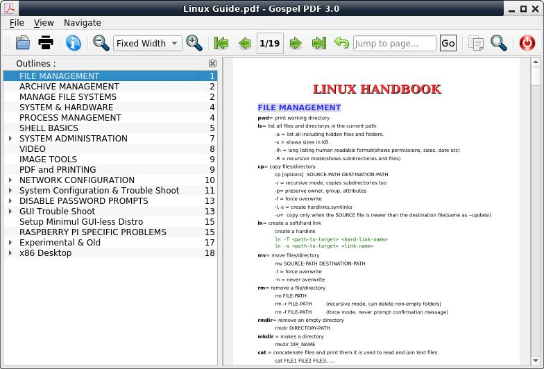
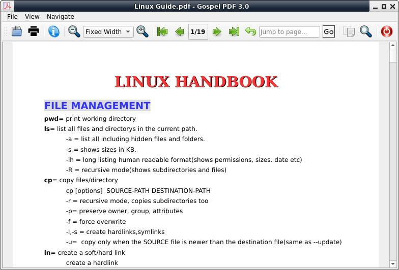
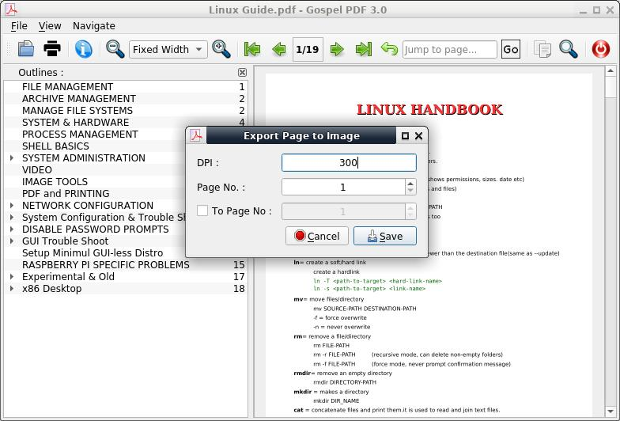

# Gospel Pdf Viewer
Poppler or MuPDF based pdf viewer for Windows and Linux written in PyQt

### Description
This program is aimed at short startup time, with all generally used features.  
This is a evince or qpdfview alternative for linux users.

### Download
Download the precompiled packages from [releases page](https://github.com/ksharindam/gospel-pdf-viewer/releases).  
For Windows download .exe package and install it.  
For Linux download .AppImage package, mark it executable, and double click to run.  

### Installation using PIP
**Dependency :**  
* python3-pyqt5  
* pyqt5-dev-tools  
* python3-poppler-qt5 or pymupdf  
* quikprint (for print support, optional)  
* qpdf (to unlock pdf, optional)  

To Install this program open terminal inside gospel-pdf-viewer directory.  
First compile UI and Resources file  
`cd data`  
`./compile_ui`  
`./compile_rc`  
`cd ..`  
And then run following command..  
`sudo pip3 install .`  
or  
`pip3 install --user .`  

Gospel PDF will be automatically added to application menu.

To uninstall run..  
`sudo pip3 uninstall gospel-pdf`

### Usage
To run after installing, type command..  
  `gospel-pdf`  
Or  
  `gospel-pdf filename.pdf`  

If you want to run this program without/before installing, then  
Open terminal and change directory to gospel-pdf-viewer and run  
  `./gospel_pdf.py`  

### Screenshots

  

  

  

