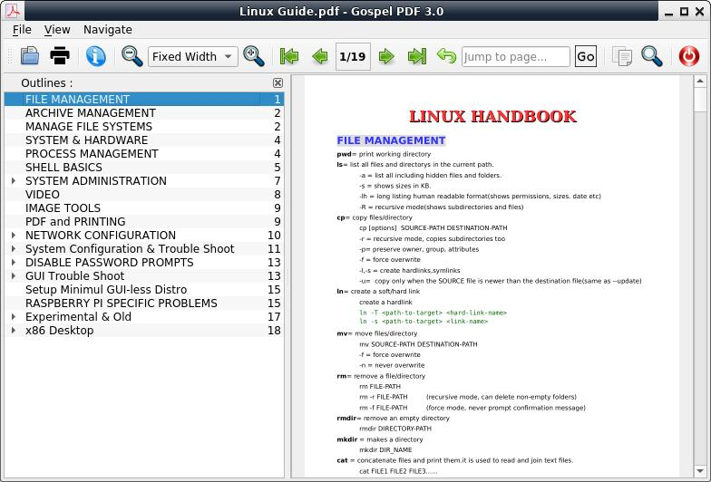
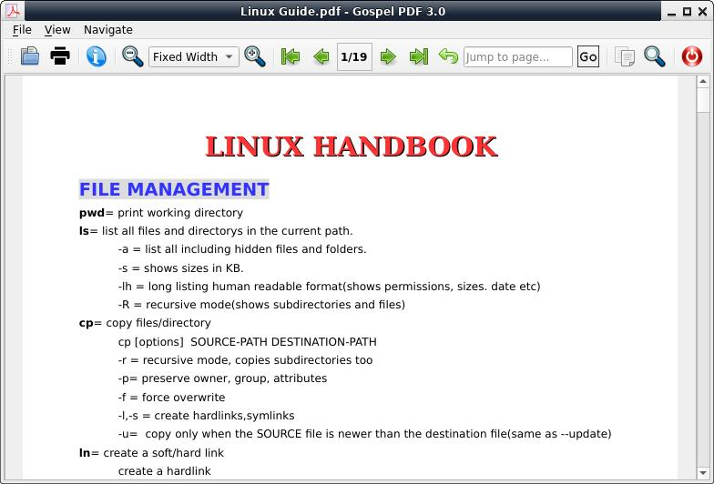
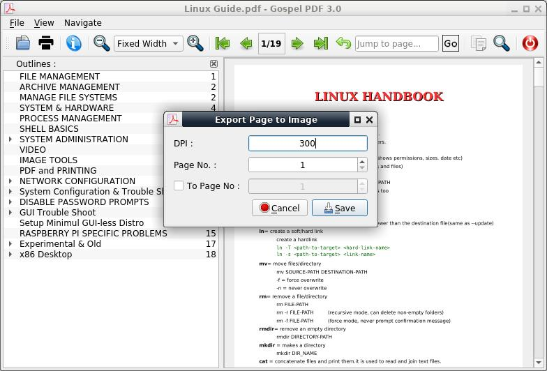

# PDF Bunny
Simple yet powerful pdf viewer for Windows and Linux  

### Description
This program is aimed at short startup time, with all generally used features.  
This is a evince or qpdfview alternative for linux users.

### Download

|    Windows    |    AArch64    |    AppImage   |     Debian    |  
| ------------- | ------------- | ------------- | ------------- |  
|  |  |   |   |  
| [Download](https://github.com/ksharindam/pdf-bunny/releases/latest/download/PDF_Bunny.exe) | [Download](https://github.com/ksharindam/pdf-bunny/releases/latest/download/PDF_Bunny-aarch64.AppImage) | [Download](https://github.com/ksharindam/pdf-bunny/releases/latest/download/PDF_Bunny-x86_64.AppImage)  | [Download](https://github.com/ksharindam/pdf-bunny/releases/latest/download/pdf-bunny_all.deb)  |  

Download the precompiled packages from [releases page](https://github.com/ksharindam/pdf-bunny/releases).  
For Windows download .exe package and install it.  
For Linux download .AppImage package, mark it executable, and double click to run.  

### Installation using PIP
**Dependency :**  
* python3-pyqt5  
* pyqt5-dev-tools  
* python3-poppler-qt5 or pymupdf  
* qpdf (to unlock pdf, optional)  

To Install this program open terminal inside project root directory.  
Run following command..  
`sudo pip3 install --no-build-isolation .`  
or  
`pip3 install --user --no-build-isolation .`  

To uninstall run..  
`sudo pip3 uninstall pdf-bunny`  

### Screenshots

  

  

  

